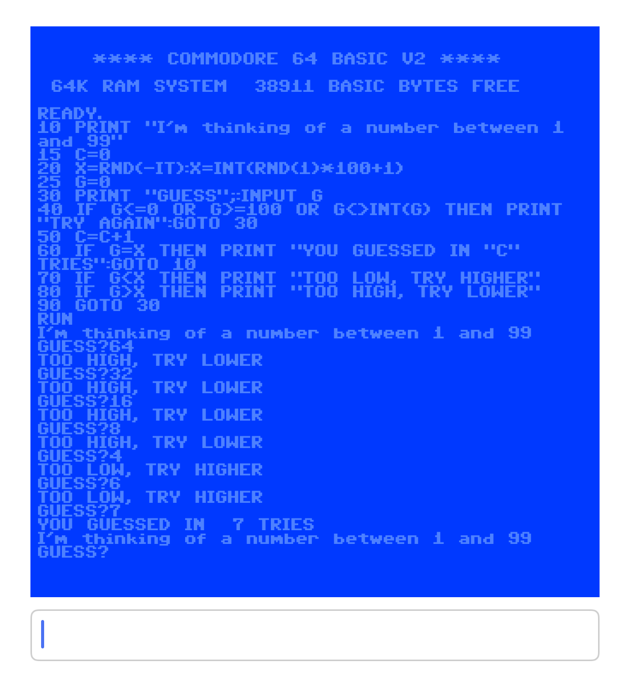

# C64 BASIC for iOS (c-simple-emu6502-cbm)

An iOS app which runs C64 BASIC based on [c-simple-emu6502-cbm](https://github.com/davervw/c-simple-emu6502-cbm).

## ROMs

To run this app you need to add the following ROMs and select them as a target:

- basic.901226-01.bin
- characters.901225-01.bin
- kernal.901227-03.bin

## Screenshot

